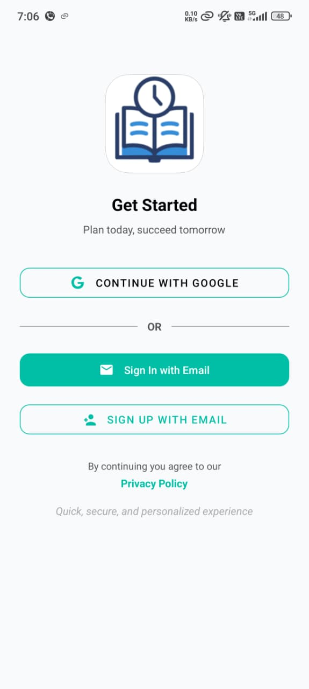
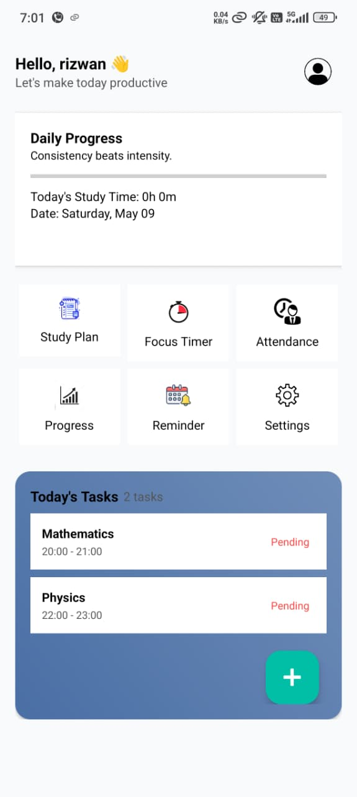
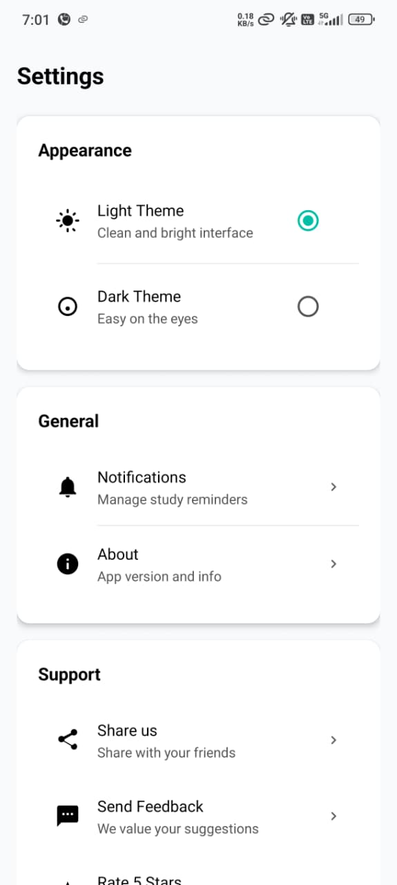
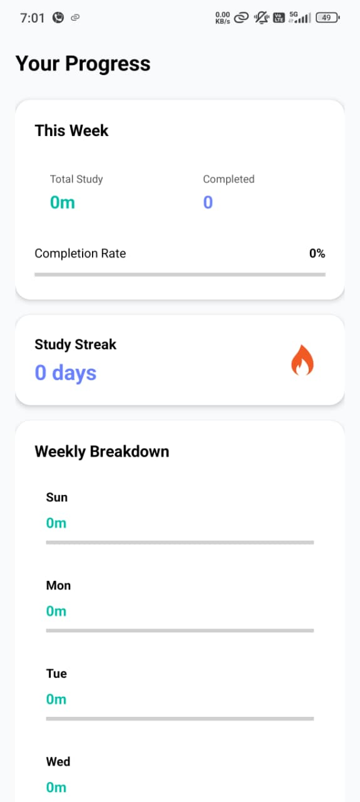
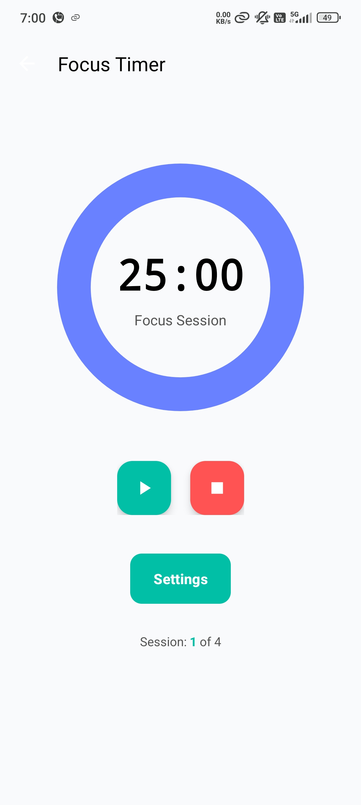
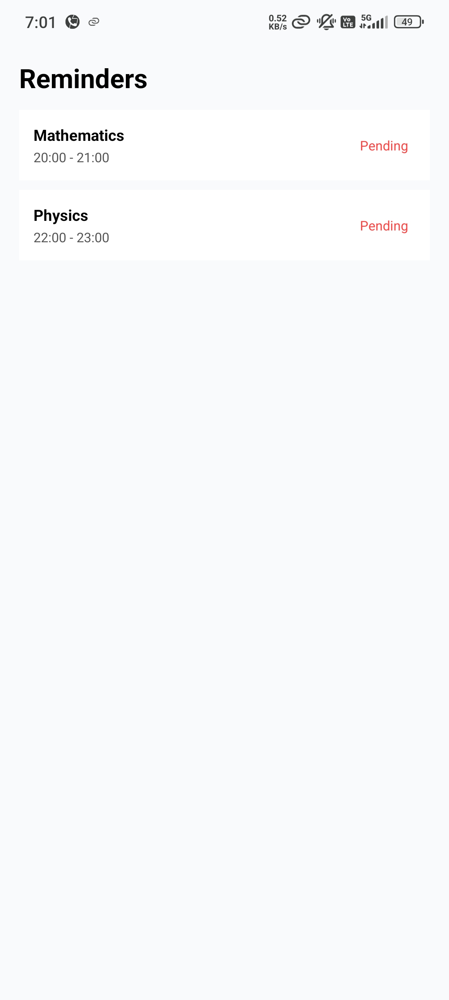
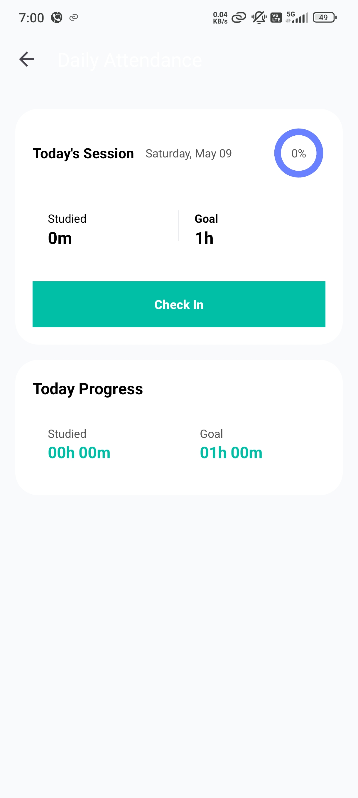
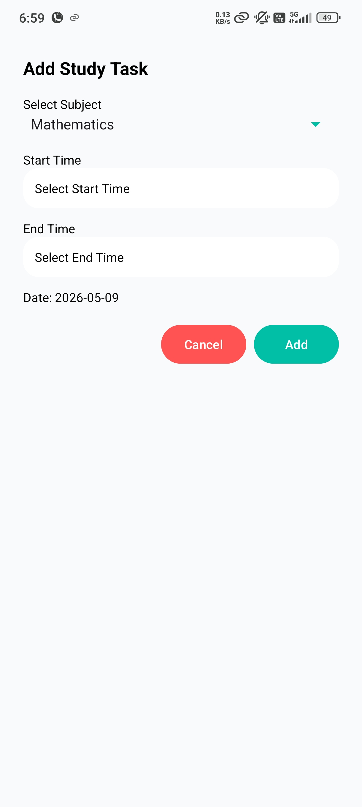
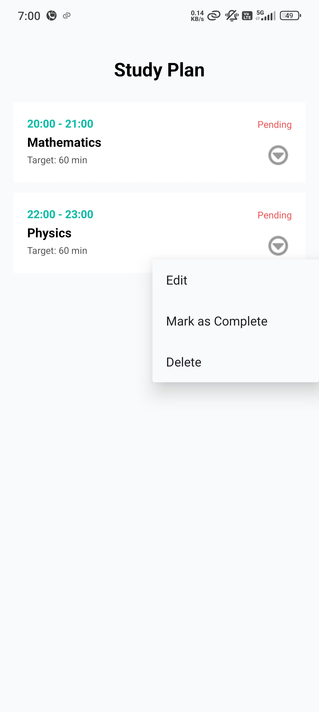

## StudySprint – Android Study Planner

StudySprint is an Android app that helps students plan daily study sessions, stay focused, and track long‑term progress. It works fully offline for tasks and progress data, with Firebase Authentication for secure sign‑in.

### Features

- **Smart daily planning**: Create subject‑wise study tasks with start/end times and target duration (SQLite `tasks` table).
- **Dashboard overview**: See today’s total study time, task count, completion progress bar, and today’s schedule.
- **Focus tools**: Focus timer, attendance/logs, reminders, and weekly progress breakdown.
- **Profile & settings**:
  - Google / email & password login via **Firebase Auth**
  - Profile screen with name/email and editable display name
  - Light/Dark theme toggle
  - Share app, send feedback, rate on Play Store, privacy policy link
  - Logout and delete‑account flows (with confirmation dialogs)
- **Completely offline tasks**: All study tasks and stats are stored locally in SQLite; no sensitive notes are uploaded.

### Tech Stack

- **Language**: Java
- **Architecture**: Single‑module Android app (`app`)
- **Storage**: SQLite via `TaskDBhelper` (`focus_tasks.db`, `tasks` table)
- **Auth**: Firebase Authentication (Google + email/password)
- **UI**: Material Components, custom dialogs, dark/light themes

### Getting Started

1. **Clone the repo**

  
   git clone https://github.com/<your-username>/study-sprint-android.git
   cd study-sprint-android
   2. **Firebase setup**

   - In Firebase Console, create a project and add an **Android app** with `applicationId`:
     - `com.example.mad_theory`
   - Enable:
     - **Email/Password** sign‑in
     - **Google** sign‑in
   - Download `google-services.json` and place it in `app/google-services.json`.
   - Do **not** commit this file (it’s git‑ignored).

3. **Open in Android Studio**

   - Open the project folder in Android Studio.
   - Let Gradle sync.
   - Run the `app` configuration on a device/emulator (Android 10+ recommended).
  
4. Screenshots
   <h3 align="center">📸 App Screenshots</h3>

  
  
  

  
  
  

  
  
  

   

### Project Structure (high‑level)

- `app/src/main/java/com/example/mad_theory/`
  - `DashboardActivity` – main home dashboard
  - `AddTaskActivity`, `StudyPlanActivity`, `AttendanceActivity`, `ProgressActivity`, `ReminderActivity`
  - `AuthStartActivity`, `LoginActivity`, `SignupActivity`
  - `ProfileActivity`, `EditProfileActivity`
  - `SettingsActivity`, `TaskDBhelper`, `UserPrefs`
- `app/src/main/res/layout/` – screens and custom dialogs
- `DATABASE_STRUCTURE.md` – documentation of the SQLite schema and data flow

### License

Educational / personal project. Feel free to fork for learning purposes.
